# Centro Paula Souza  
## Etec Vasco Antonio Venchiarutti – Jundiaí - SP  

### Curso  
Técnico em Desenvolvimento de Sistemas Integrado ao Ensino Médio  

### Turma  
2C1  

### Autores  
Bruno Lourenço de Lima
Isaac Faleiros Quevedo

# APP INVENTOR  

Jundiaí  
2026  

## Projeto 1 – Primeiro Aplicativo (pg. 27)

### Descrição

O objetivo do aplicativo é mostrar uma mensagem na tela quando o usuário clica em um botão. Ele funciona da seguinte forma: ao clicar em “Clique aqui”, aparece a mensagem “Olá Mundo”. O botão “Limpar” apaga o texto da tela e o botão “Fechar” encerra o aplicativo. Em relação ao exemplo da apostila, mudamos a imagem e organizamos diferente.

### Print do Design  
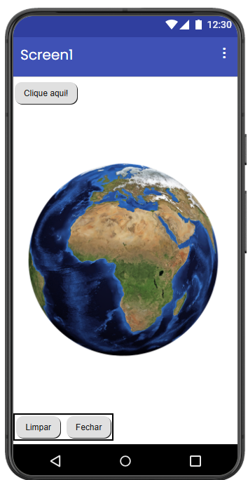

### Print dos Blocos  
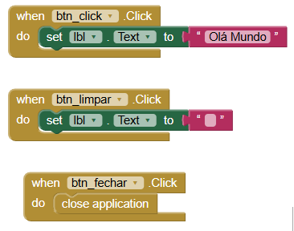

## Projeto 2 – Aplicativo de Desenho (pg. 46)

### Descrição

O objetivo do aplicativo é permitir que o usuário desenhe na tela do celular. Ele funciona com um Canvas onde o usuário pode arrastar o dedo para desenhar linhas. Existem botões com as cores vermelho, verde, azul e amarelo, que mudam a cor do pincel. Em relação ao exemplo da apostila, organizamos melhor os botões na tela.

### Print do Design  

### Print dos Blocos  

## Projeto 3 – Liquidificador (pg. 56)

### Descrição

O objetivo do aplicativo é simular o funcionamento de um liquidificador utilizando som e vibração do celular. Ele funciona da seguinte forma: ao clicar no botão, o aplicativo reproduz um som e faz o celular vibrar por alguns segundos. Em relação ao exemplo da apostila, organizamos melhor os componentes.

### Print do Design  
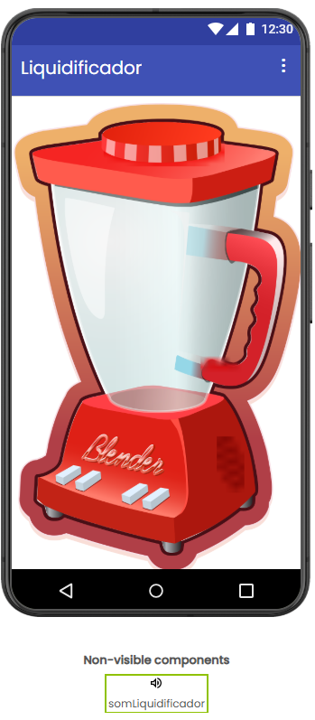

### Print dos Blocos  
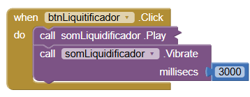

## Projeto 4 – Aplicativo de Câmera (pg. 64)

### Descrição

O objetivo do aplicativo é utilizar a câmera do celular para tirar fotos e exibi-las na tela. Ele funciona da seguinte forma: ao clicar no botão “Tirar foto”, a câmera é aberta. Depois que a foto é tirada, a imagem aparece no aplicativo. Também existe um botão para fechar a tela. Em relação ao exemplo da apostila, organizamos melhor os componentes.

### Print do Design  
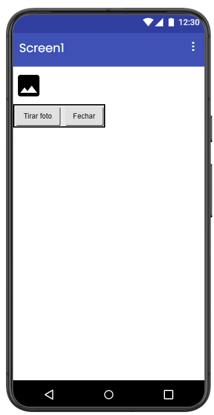

### Print dos Blocos  
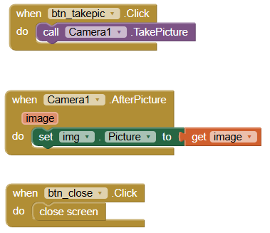

## Projeto 5 – Navegação entre Telas (pg. 69)

### Descrição

O objetivo do aplicativo é criar várias telas e permitir a navegação entre elas. Ele funciona com botões que levam o usuário de uma tela para outra, como da tela inicial para a Screen2 e Screen3, e também permitem voltar para a tela principal. Em relação ao exemplo da apostila, organizamos melhor os botões e deixamos o design diferente.

### Print do Design  
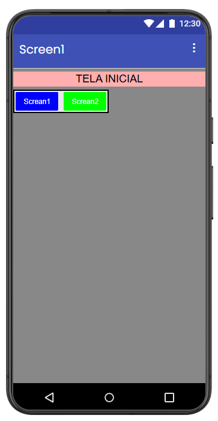
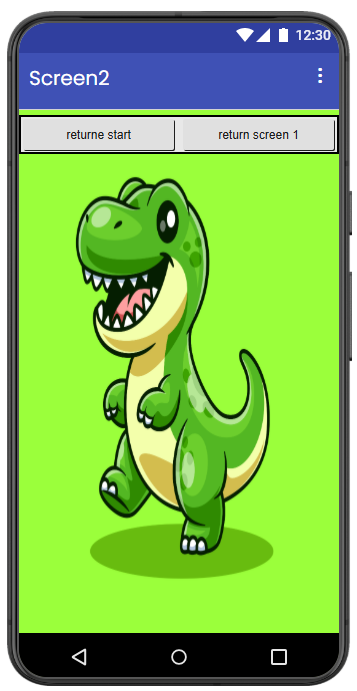
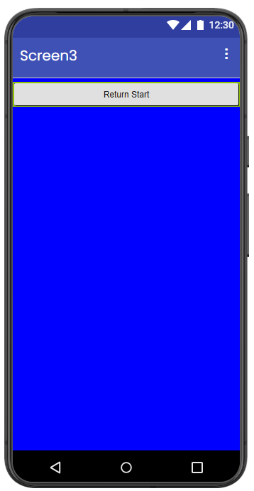

### Print dos Blocos  
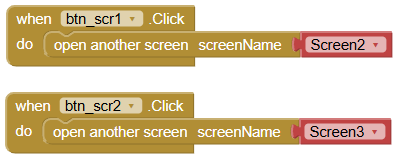
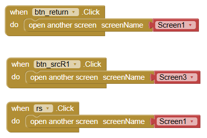

## Projeto 6 – Saudação Personalizada (pg. 82)

### Descrição

O objetivo do aplicativo é mostrar uma mensagem personalizada com o nome digitado pelo usuário. Ele funciona da seguinte forma: o usuário digita seu nome em uma caixa de texto e, ao clicar no botão, aparece uma mensagem de saudação com o nome digitado. Em relação ao exemplo da apostila, mudamos o design.

### Print do Design  
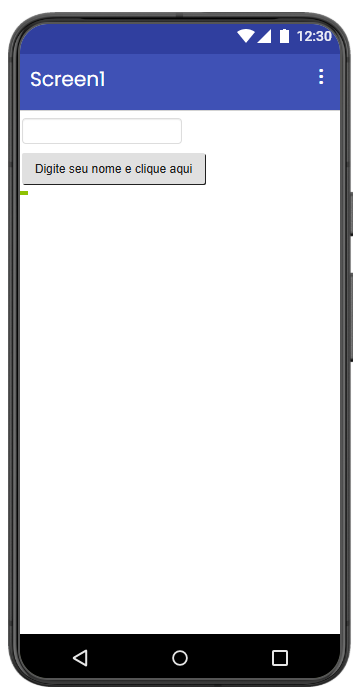

### Print dos Blocos  
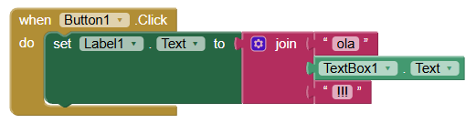

