# Instituição
## Etec Vasco Antônio Venchiarutti

## Curso
Desenvolvimento de Sistemas

## Turma
2°C¹

## Autores
Bruno Lourenço de Lima
Isaac Faleiros Quevedo

---

# 📱 Projeto

## Título
Petróleo Clcker Simulator

---

## Descrição

Descrever:

- Objetivo do aplicativo: 
    Divertir o usuário de forma simples e intuitiva, passar o tempo e por meio de perguntas implementadas, informar sobre a guerra e atiçar a curiosidade sobre esse assunto.

- Como o aplicativo funciona: 
    O jogo começa clicando no botão 'Play', no canto superior direito da tela, se tornando um botão 'Reset' após isso. Quando o jogo inicia, se baseia em clicar no botão 'Extrair Petróleo' para acumular petróleo e com esse petróleo acumulado ir para a página upgrades, clicando no botão 'Upgrades', e gastar os pontos de petróleo para pegar melhorias e assim adquirir pontos mais rápido. A cada 2 minutos também aparece um botão para responder a uma pergunta, e caso acerte, ganha 2x de pontos por 30 segundos.

- Quais conceitos da apostila foram utilizados: 
    Botão, parte essencial do jogo que foi muito utilizado na apostila; múltiplas páginas, como feito em um dos aplicativos tutoriais da apostila; texto básico como label.

- Quais recursos ou componentes foram utilizados: 
    Label; Button; Vertical Scroll Arrangement; Horizontal Arrangement; Image; TinyDB; Clock; CheckBox.

- Se houve melhorias ou ideias novas em relação aos exemplos da apostila: 
    Com os trabalhos que fizemos na apostila, não aprendemos sobre TinyDB, Clock, tela scrolável e alguns códigos utilizados, sendo essas novas ideias em relação ao apresentado na apostila.

---

# 🖥 Print das telas do Design

## Tela Inicial
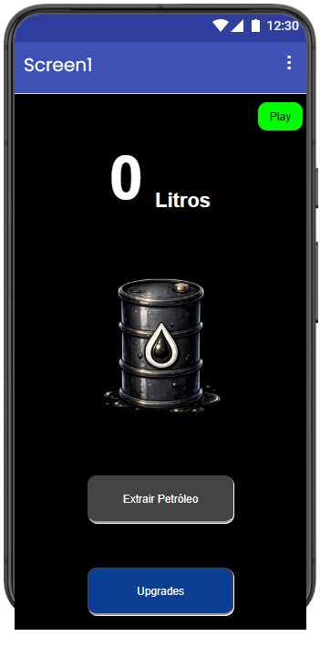

## Upgrades
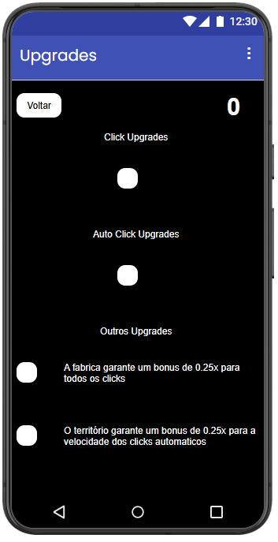
**obs: os botões estão em branco porque seu preço e respectivos upgrades variam de acordo com o número de vezes comprado, então seu texto é colocado por meio do código**

## Pergunta 1
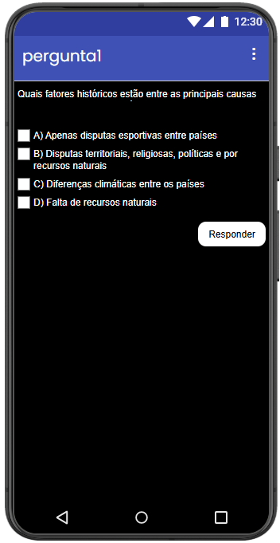

## Pergunta 2
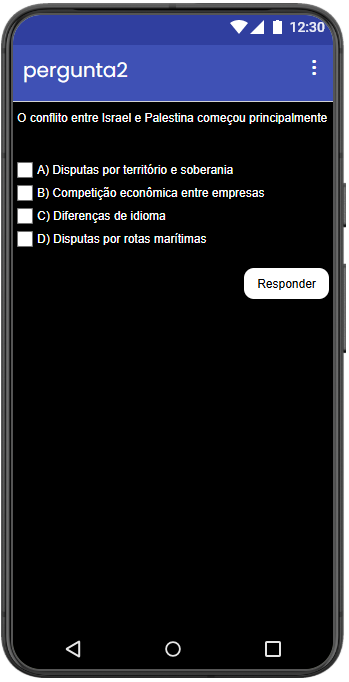

## Pergunta 3
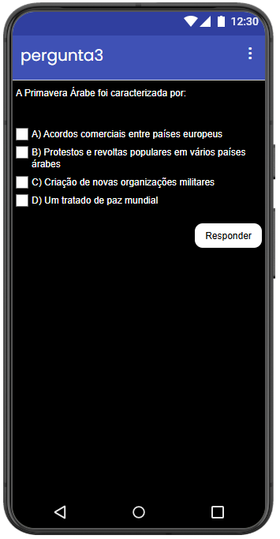

## Pergunta 4
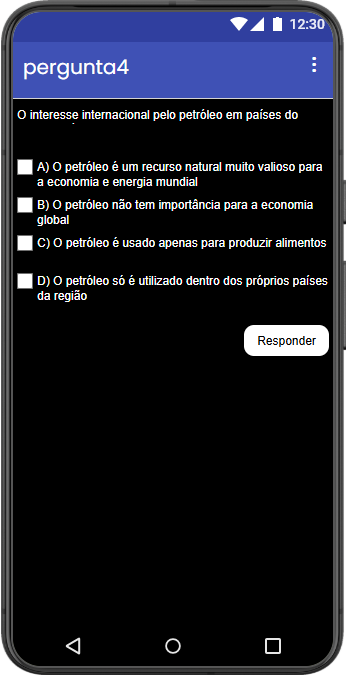

---

# 🧩 Print das telas dos Blocos

## Tela Inicial
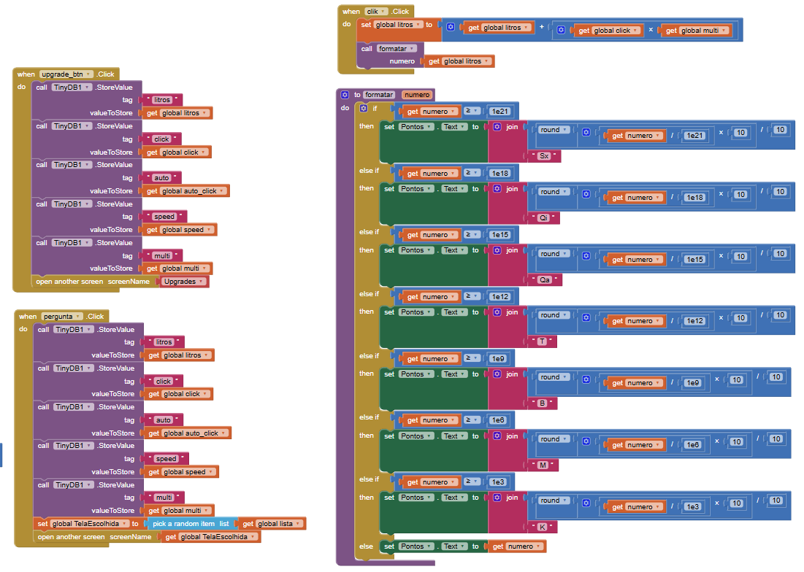
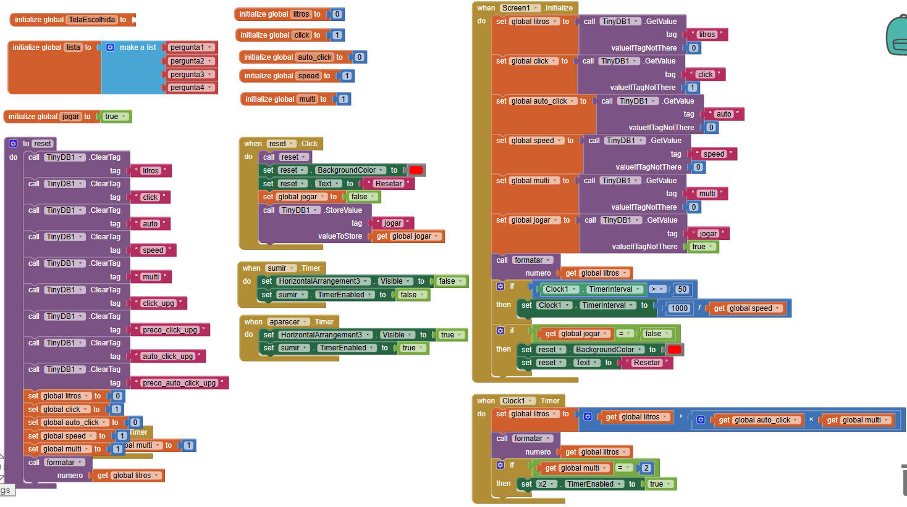

## Upgrades
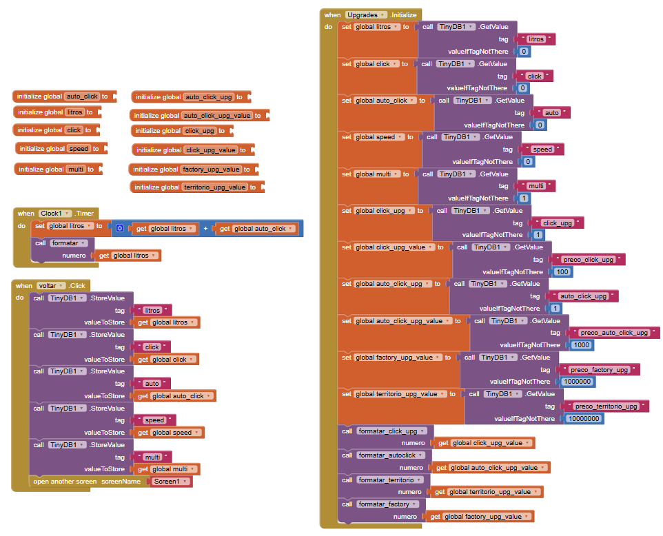
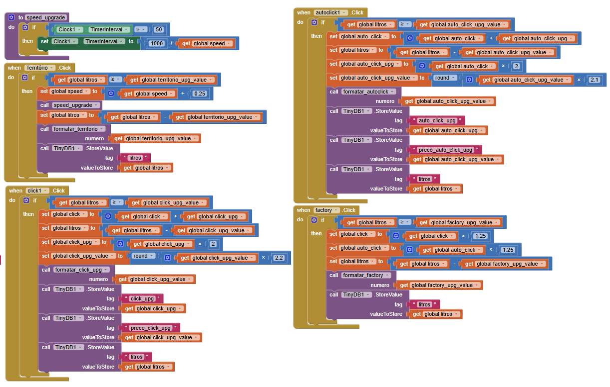
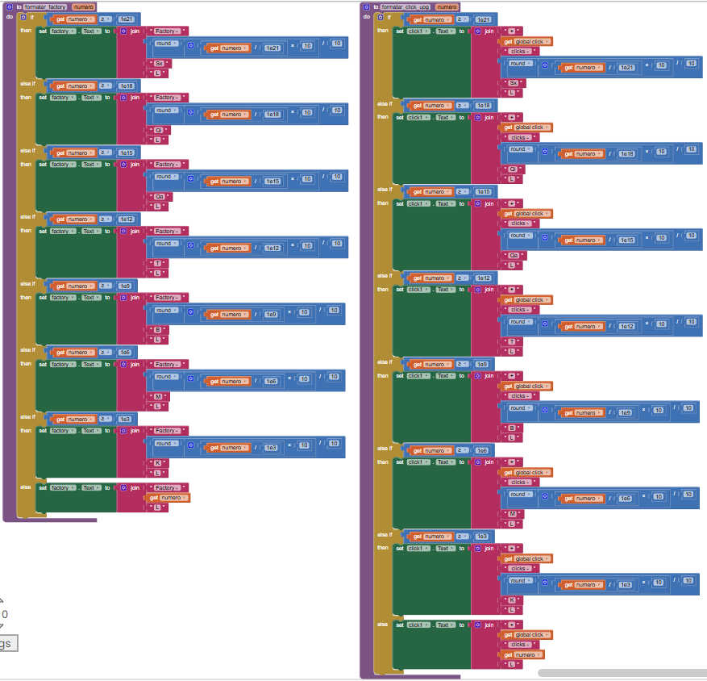
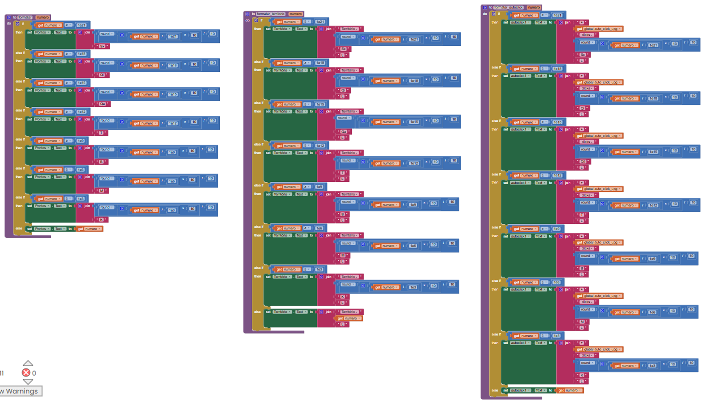

## Pergunta 1
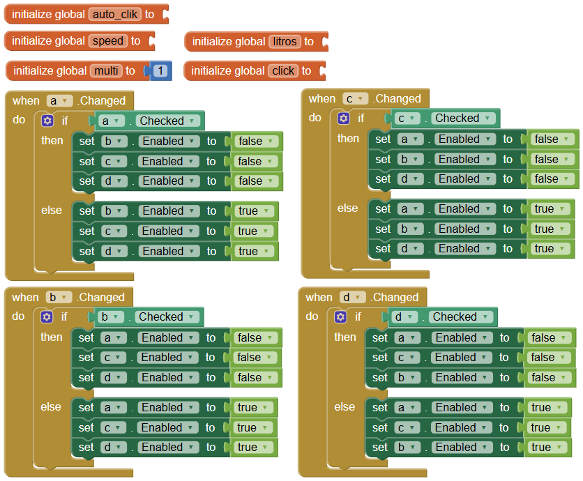
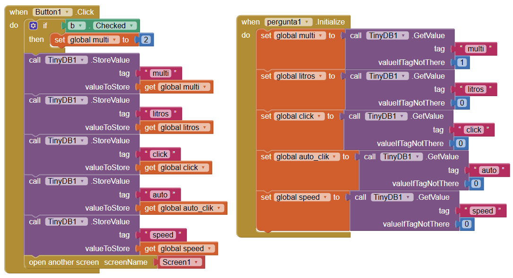

## Pergunta 2
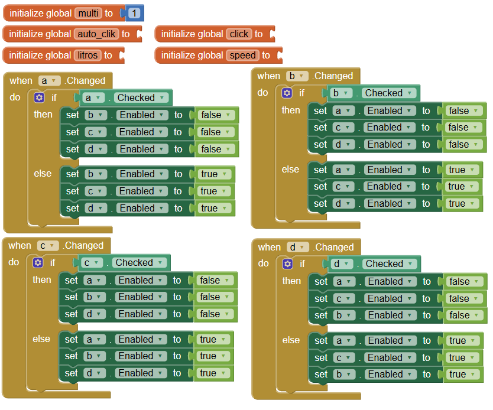
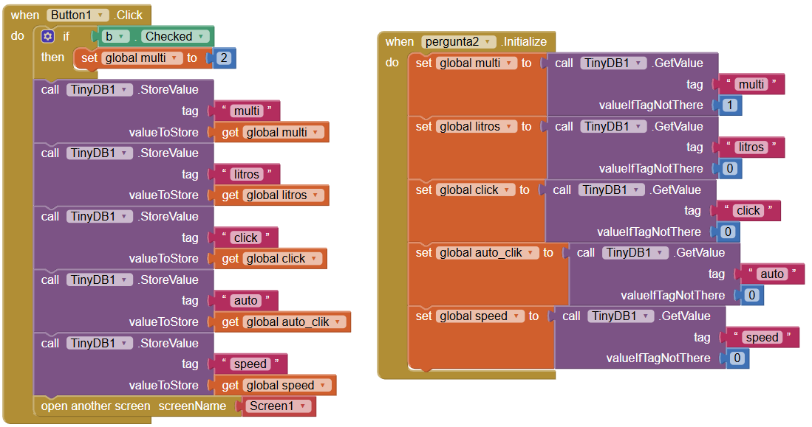

## Pergunta 3
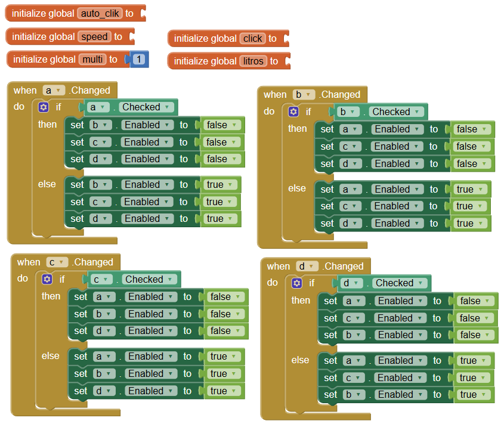
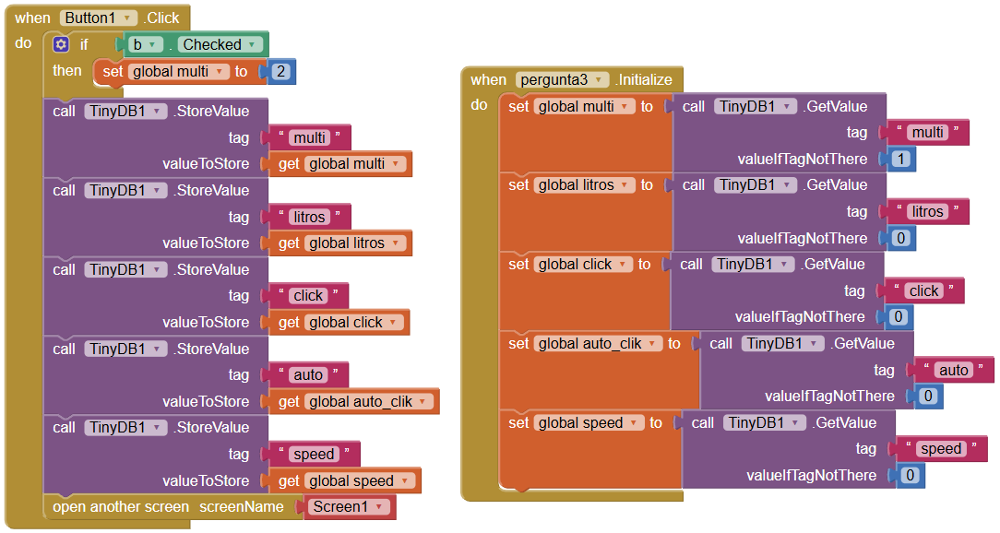

## Pergunta 4
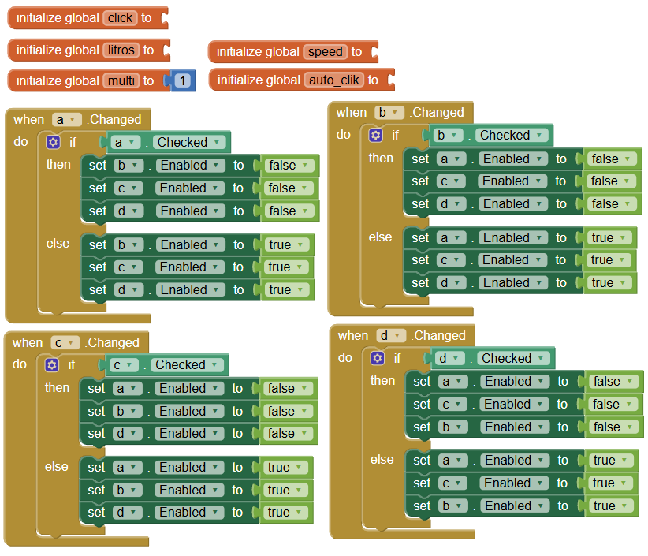
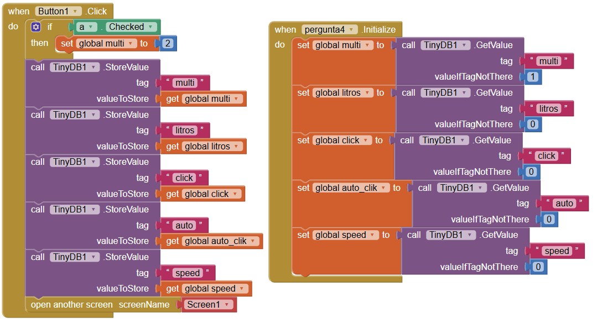